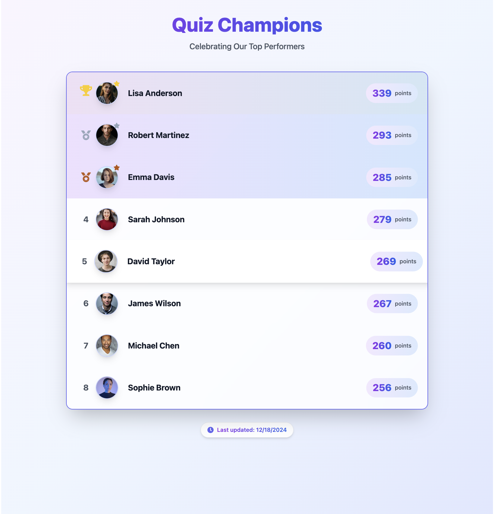
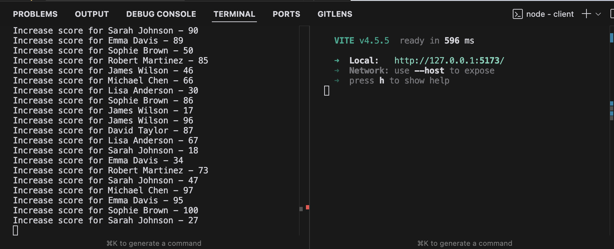
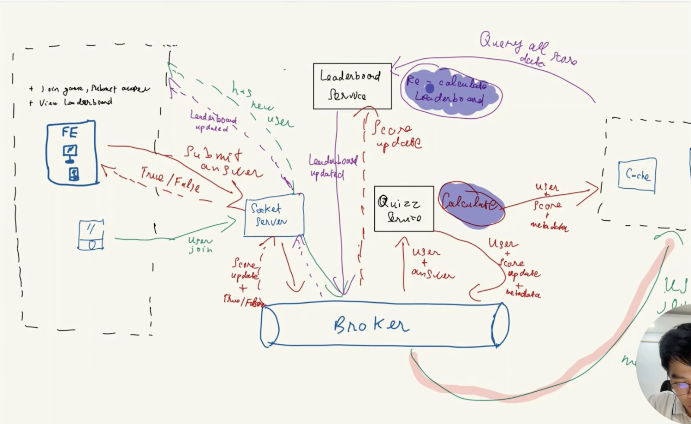

# Real-Time Vocabulary Quiz Coding Challenge

## Show cases





## Overview

Welcome to the Real-Time Quiz coding challenge! Your task is to create a technical solution for a real-time quiz feature for an English learning application. This feature will allow users to answer questions in real-time, compete with others, and see their scores updated live on a leaderboard.

## Original Requirement

For more details, refer to the original requirement [here](https://github.com/elsa/coding-challenges/blob/main/README.md).

## Architecture Diagram


For detail explaination, please watch [my Coding Challenge video ](https://drive.google.com/file/d/14FqkA4TQSCG338Xl83ncGJgDM1N1DaMv/view?usp=drive_link)

## Detailed System Proposal

### 1. Client (Frontend)

- Built with React.js and Tailwind CSS
- Handles user interface and real-time updates
- Communicates with the server via WebSocket (Socket.IO client)

### 2. Server (Backend)

- Built with Node.js and Socket.IO
- Manages WebSocket connections and real-time events
- Handles quiz logic, scoring, and ranking

## Technologies and Tools

### Frontend:

- **React.js**: A popular library for building user interfaces, ideal for creating interactive UI components.
- **Tailwind CSS**: A utility-first CSS framework for rapid UI development, providing flexibility and ease of styling.
- **Socket.IO Client**: Enables real-time communication with the server, widely used for real-time web applications.

### Backend:

- **Node.js**: A JavaScript runtime for building scalable network applications.
- **Socket.IO**: A library that enables real-time, bidirectional communication.
- **Express.js**: A minimal web application framework for Node.js.

## Scalability Considerations

- Scale the database to a Master-Slave architecture with multiple instances.
- Scale services to multiple instances.
- Implement a queue system.
- Utilize a Content Delivery Network (CDN).

## Performance Optimizations

- Optimize data transfer by only sending essential updates.
- Utilize Redis data structures for fast read/write operations.
- Implement client-side debouncing for frequent updates, such as typing.

## How to Run the Application

### Backend

1. Navigate to the backend directory.
2. Run `npm install` to install dependencies.
3. Start the server with `npm start`.

### Frontend

1. Navigate to the frontend directory.
2. Run `npm install` to install dependencies.
3. Start the development server with `npm dev`.

## Chosen Component: Real-time Leaderboard

### Implementation Plan for the Leaderboard:

- **Backend**:
  - Create a route or socket event that continuously sends updated ranking data to the frontend whenever a participant’s score changes.
- **Frontend**:
  - Develop a Leaderboard component that subscribes to a `leaderboard_update` event and updates the UI in real-time.

### Mocking Components:

1. **Real-time Quiz Participation**:
   - Simulate the quiz joining process by hard-coding a quiz ID or using a mock function.
   - The backend can maintain a hardcoded set of participants.
2. **Real-time Score Updates**:
   - Simulate score updating events by generating periodic random score updates from the server to trigger leaderboard changes.

## Backend

Get Leaderboard

This payload retrived via websocket emit event

```json
{
  "quizId": "12345",
  "leaderboard": [
    { "userId": "user1", "userName": "John Doe", "score": 20 },
    { "userId": "user2", "userName": "Jane Doe", "score": 15 }
  ]
}
```

- **Mock Function**: Return sorted participant scores.

## Conclusion

This README provides a comprehensive overview of the Real-Time Vocabulary Quiz project, detailing the system design, technologies used, and how to run the application. For further questions or contributions, feel free to reach out.
